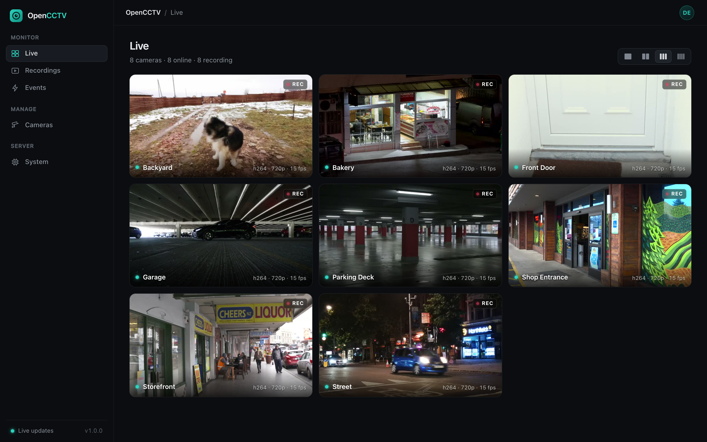
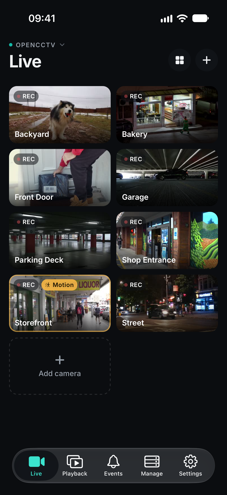
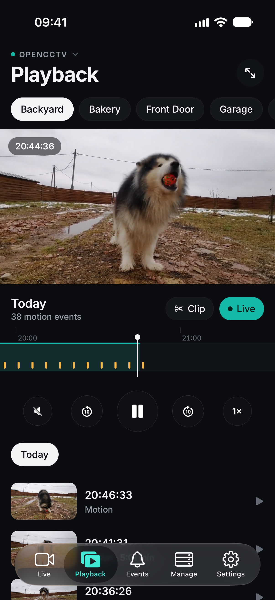
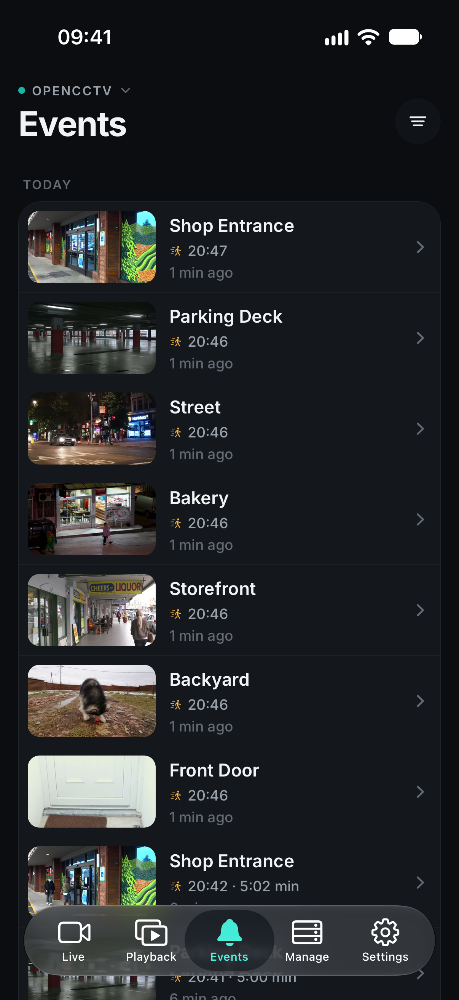
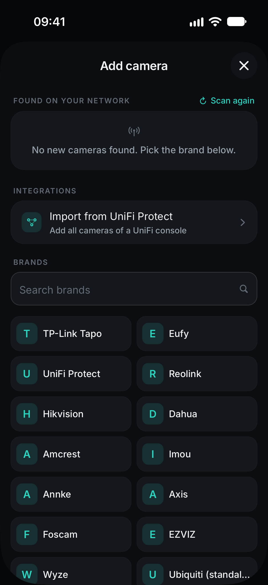

# OpenCCTV

**Your cameras. Your server. Your storage.**

OpenCCTV is a free, open-source camera server, NVR and cloud recorder with native apps for iPhone and Android. It turns the IP cameras you already own (TP-Link Tapo, UniFi Protect, Reolink, Hikvision, Dahua, Eufy, any ONVIF or RTSP camera) into a complete security system: live view, 24/7 or motion recording, uploads to Google Drive, S3, FTP, SFTP, SMB or WebDAV with automatic cleanup, motion alerts, and remote access through a gateway without port forwarding.

No vendor cloud, no subscription, no account with us.

[Website](https://opencctv.codext.de) · [Live demo](https://opencctv-demo.codext.de) (login `demo` / `demo`) · [Server docs](server/README.md) · [API](docs/API.md)



## What you get

- **Works with your cameras.** Brand presets for Tapo, Eufy, UniFi, Reolink, Hikvision, Dahua, Amcrest, Axis, Foscam, EZVIZ, Imou, Annke and Wyze, ONVIF discovery on your network, one-step UniFi Protect import. Cameras that can only send video can push RTMP or RTSP to the server.
- **Live view in under a second.** WebRTC with MSE and HLS fallback, HD and SD streams, snapshots, two-way audio and PTZ on supported cameras.
- **Recording.** Continuous or motion-only per camera, stored the way the camera sends it (no re-encoding), with a timeline, motion markers and clip export.
- **Your own cloud.** Recordings are copied to Google Drive, S3-compatible storage, FTP, SFTP, SMB, WebDAV, Dropbox, OneDrive or a local folder and deleted automatically after the number of days you choose. Ideal for cameras without an SD card or cloud plan.
- **Motion alerts.** Motion detection on the server, events with snapshots, push notifications to the app.
- **Remote access.** Any OpenCCTV server can act as a gateway (for example on a small VPS). Home servers keep an outbound tunnel to it, so the app works from anywhere without opening ports.
- **Apps for iPhone and Android** and a web UI. Pair a phone by scanning a QR code.

## Apps

| | |
|---|---|
| iPhone | App Store (in review) |
| Android | Google Play (in review) |

The app source is in [`app/`](app) (Expo, React Native). Tap **Try the live demo** in the app to look around without a server.

<p>




</p>

## Quick start

Docker (Linux, host networking for camera discovery):

```sh
docker run -d --name opencctv --restart unless-stopped --network host \
  -v opencctv:/data ghcr.io/codextde/opencctv:latest
```

Then open `http://<server-ip>:8080`, create the admin account and add your cameras.

Linux or macOS without Docker:

```sh
curl -fsSL https://opencctv.codext.de/install.sh | sh
```

Windows (PowerShell):

```powershell
irm https://opencctv.codext.de/install.ps1 | iex
```

Binaries for Linux (x64, arm64), macOS (Apple silicon, Intel) and Windows are attached to every [release](https://github.com/codextde/opencctv/releases). The server downloads go2rtc, ffmpeg and rclone on first start if they are not installed.

Coolify: use [`deploy/coolify/docker-compose.yml`](deploy/coolify/docker-compose.yml). Everything else (camera setup per brand, Tapo camera accounts, Google Drive, the gateway, environment variables) is in the [server README](server/README.md).

## How it works

```
cameras ──RTSP/ONVIF/RTMP──▶ OpenCCTV server ──rclone──▶ Google Drive / S3 / FTP / SMB / NAS
                                  │
                       WebRTC · HLS · API · push
                                  │
              iPhone / Android / browser  (LAN, VPN or the gateway)
```

The server is written in TypeScript on [Bun](https://bun.sh) and builds on three excellent open-source tools: [go2rtc](https://github.com/AlexxIT/go2rtc) for camera protocols and streaming, [ffmpeg](https://ffmpeg.org) for recording and motion detection, and [rclone](https://rclone.org) for storage.

## Repository

| Folder | Contents |
|---|---|
| [`server/`](server) | Camera server, recorder, gateway and web UI |
| [`app/`](app) | iOS and Android app (Expo) |
| [`website/`](website) | opencctv.codext.de |
| [`docs/`](docs) | HTTP API |
| [`deploy/`](deploy) | Coolify compose for the public demo |
| [`demo/`](demo) | Footage for the demo cameras (Pexels license) |

## Contributing

Issues and pull requests are welcome. Run `bun run typecheck && bun test` in `server/` and `bun run typecheck` in `app/` before opening a pull request.

## License

MIT, see [LICENSE](LICENSE). Made by [Codext GmbH](https://codext.de).
